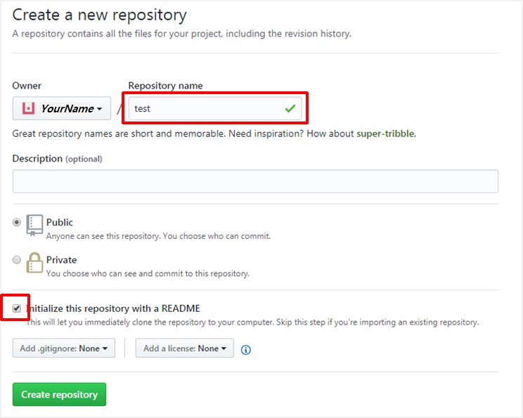
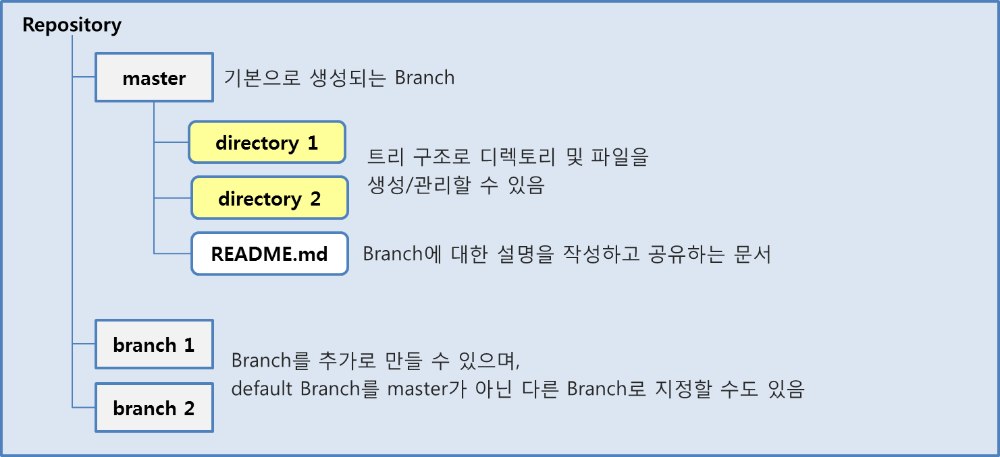

## Join GitHub

1. Open a web browser and go to https://github.com
2. Fill the textboxes with your information.(Skip this step if you already have GitHub account)

{: width="300" height="200"}

3. Select a plan on Step 2.
4. You don't need to complete Step 3, just skip to the next.

5. Open your mailbox and verify your email address.

---

## Create Repository

1. Click [New repository] and set the name of your repository.
2. Check the box for initializing with a README.md.
3. Click [Create Repository] to proceed.
   

Now, you've done creating your repository.
README.md will be used to explain your project or whatever.

{: width="50" height="50"}
