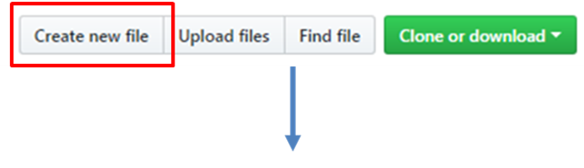
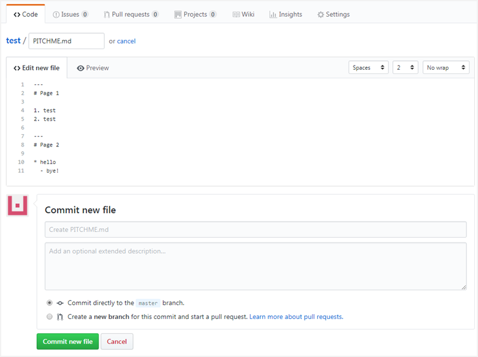

* Repository에 PITCHME.md 파일을 생성하고 아래 예시를 입력합니다.

```
---
# 슬라이드 1
안녕하세요, 반갑습니다.

---
# 슬라이드 2
그럼 이만...
```

{: width="600px"}

{: width="600px"}


* 웹 브라우저 주소창에 아래와 같이 입력하면 해당 문서를 슬라이드로 렌더링한 화면을 볼 수 있습니다.
  - https://gitpitch.com/*사용자명*/*Repository명*/*Branch명* (Branch명이 master이면 생략 가능)
  - 예: https://gitpitch.com/ssafy2018/public

{: width="400px"}


* Git Pitch의 자세한 사용법은 아래 링크에서 확인할 수 있습니다.
  - https://gitpitch.com/docs
